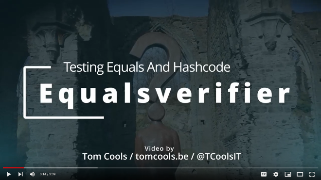

# EqualsVerifier

[](https://github.com/jqno/equalsverifier/blob/master/LICENSE.md)
[](https://maven-badges.herokuapp.com/maven-central/nl.jqno.equalsverifier/equalsverifier/)
[](https://javadoc.io/doc/nl.jqno.equalsverifier/equalsverifier)

[](https://github.com/jqno/equalsverifier/actions)
[](https://dependabot.com/compatibility-score/?dependency-name=nl.jqno.equalsverifier:equalsverifier&package-manager=maven&version-scheme=semver)
[](https://isitmaintained.com/project/jqno/equalsverifier "Average time to resolve an issue")

**EqualsVerifier** can be used in Java unit tests to verify whether the contract for the equals and hashCode methods in a class is met.

# Getting Started

EqualsVerifier's Maven coordinates are:

```xml
<dependency>
    <groupId>nl.jqno.equalsverifier</groupId>
    <artifactId>equalsverifier</artifactId>
    <version>3.11</version>
    <scope>test</scope>
</dependency>
```

(Note that there's also a 'fat' jar with no transitive dependencies with artifactId `equalsverifier-nodep`.)

Now you can write a test:

```java
@Test
public void equalsContract() {
    EqualsVerifier.forClass(Foo.class).verify();
}
```

EqualsVerifier is an opinionated library, which means that it can be quite strict. If you feel it's too much, you can make it more lenient:

```java
@Test
public void equalsContract() {
    EqualsVerifier.simple().forClass(Foo.class).verify();
}
```

This way, EqualsVerifier will throw less errors at you. However, it's usually better to just fix the errors: EqualsVerifier throws them for a reason!

For more information, please see the [project's website](https://www.jqno.nl/equalsverifier).

## Prefer to watch a short video?

[](http://www.youtube.com/watch?v=ivRjf8yvVMk "Video Title")

<small>Video by [Tom Cools](https://twitter.com/TCoolsIT)</small>

# A note on equality

EqualsVerifier cares about bug-free equality, in Java and in real life. The place where a person happens to be born, the colour of their skin, their gender, or the person they happen to love, must not affect the way they are treated in life. If it does, that's a bug and it should throw an error.

Don't allow bugs in your equality.

🌈🧑🏻‍🤝‍🧑🏾🌍

# Contribution

Pull requests are welcome! If you plan to open one, please also [register an issue](https://code.google.com/p/equalsverifier/issues/list) or [send a message to the Google Group](https://groups.google.com/forum/?fromgroups#!forum/equalsverifier), so we can discuss it first. It would be a shame to put in a lot of work on something that isn't a good fit for the project. Also, I can help you by giving pointers on where to find certain things.

# Development

## Build

To build EqualsVerifier, you need [Maven](https://maven.apache.org/). Just call `mvn` from the command-line, without any parameters, and you're done. Alternatively, you can use any IDE with Maven support.

There are several Maven profiles that can be enabled or disabled:

| profile                | activation                                                             | purpose                                                                                                                                                        |
| ---------------------- | ---------------------------------------------------------------------- | -------------------------------------------------------------------------------------------------------------------------------------------------------------- |
| `modules-jdk8`         | JDK 8 up to but not including 11                                       | Build only the modules that are compatible with Java 8 and up.                                                                                                 |
| `modules-jdk11`        | JDK 11 up to but not including 16                                      | Build only the modules that are compatible with Java 11 and up.                                                                                                |
| `modules-jdk16`        | JDK 16                                                                 | Build only the modules that are compatible with Java 16 and up.                                                                                                |
| `modules-jdk17`        | JDK 17 and up                                                          | Build all modules and build releaseable artifacts.                                                                                                             |
| `static-analysis`      | JDK 17 and up, _and_ `disableStaticAnalysis` property must be off      | Run static analysis checks. This only happens on a recent JDK. Can be disabled by running `mvn verify -DdisableStaticAnalysis`                                 |
| `release-verification` | JDK 17 and up, _and_ `disableReleaseVerification` property must be off | Run release verification checks. This only happens on a recent JDK. Can be disabled by running `mvn verify -DdisableReleaseVerification`                       |
| `argline-preview`      | `preview` property must be on                                          | Enable Java preview features. Can be activated by running `mvn verify -Dpreview`                                                                               |
| `argline-experimental` | `experimental` property must be on                                     | Enables ByteBuddy experimental features; useful for testing EqualsVerifier on Early Access JDK builds. Can be activated by running `mvn verify -Dexperimental` |
| `pitest`               | `pitest` property must be on                                           | Used by PITest integration on GitHub. Can be activated by running `mvn verify -Dpitest`                                                                        |

## Formatting

EqualsVerifier uses [Prettier-Java](https://github.com/jhipster/prettier-java) through [Spotless](https://github.com/diffplug/spotless) to format Java files. You can call it using `mvn` (without any parameters), which will also run the tests and all the other static analysis. Or run `mvn spotless:apply` to only run the formatter.

## Modules

This project is a multi-module project to make it easier to deal with shading and multi-release jar files. See [this question on StackOverflow](https://stackoverflow.com/q/70541340/127863) for the rationale behind it.

Here's a description of the modules:

| module                        | purpose                                                               |
| ----------------------------- | --------------------------------------------------------------------- |
| docs                          | project's Jekyll website                                              |
| equalsverifier-core           | the actual EqualsVerifier code                                        |
| equalsverifier-11             | tests for Java 11 and up                                              |
| equalsverifier-16             | logic for records, and corresponding tests                            |
| equalsverifier-17             | logic for sealed classes, and corresponding tests                     |
| equalsverifier-aggregator     | generic release assembly description, and shared jacoco configuration |
| equalsverifier-release-main   | release assembly for jar with dependencies                            |
| equalsverifier-release-nodep  | release assembly for fat jar (with dependencies shaded in)            |
| equalsverifier-release-verify | validation tests for the releases                                     |

## Signed JAR

The `lib/` folder in the `equalsverifier-test-core` module contains a local Maven repository containing a signed JAR, used to test potential ClassLoader issues. Here's how to install a JAR into it:

```sh
mvn org.apache.maven.plugins:maven-install-plugin:2.3.1:install-file \
                        -Dfile=&lt;path-to-file> -DgroupId=&lt;myGroup> \
                        -DartifactId=&lt;myArtifactId> -Dversion=&lt;myVersion> \
                        -Dpackaging=&lt;myPackaging> -DcreateChecksum=true \
                        -DlocalRepositoryPath=equalsverifier-test-core/lib
```

The signed JAR itself can be found in [this repo](https://github.com/jqno/equalsverifier-signedjar-test).

## Website

To generate the website

-   Using Docker: start the server by running `docker-compose up` or `docker compose run jekyll serve`.
-   Using Jekyll: install the Ruby 3.x toolchain and run `bundle exec jekyll serve --watch`

# Disclaimer

Copyright 2009-2022 Jan Ouwens
